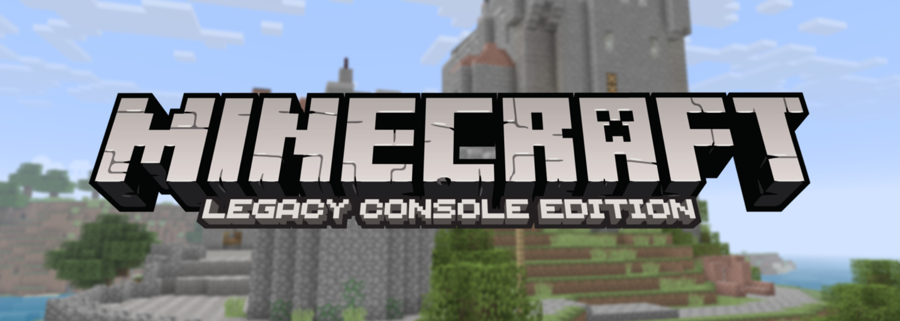

# MinecraftConsoles (Legacy Console Edition)




>[!NOTE]
> This version might be behind the behind the nighlt build due to the the rapid paste developpement of smartcmd's LCE Fork and for the stabilty of the mod. Once smartcmd will stabilise or a modding APi  arrive the update could be more up to date.

This project is based on source code of Minecraft Legacy Console Edition v1.6.0560.0 (TU19) with some fixes and improvements applied. 

## Introduction

This project contains the source code of Minecraft Legacy Console Edition v1.6.0560.0 (TU19) from https://archive.org/details/minecraft-legacy-console-edition-source-code, with some fixes and improvements applied.
with further modification by Xgui4 like readding the debug menu and changed the menu screen.
See our our [Contributor's Guide](./CONTRIBUTING.md) for more information on the goals of this project.

## Download
Windows users can download our [Nightly Build](https://github.com/xgui4/MinecraftConsoles/releases/tag/nightly)! or [Debug Nightly Build](https://github.com/xgui4/MinecraftConsoles/releases/tag/debug-nightly) Simply download the `.zip` file and extract it to a folder where you'd like to keep the game. You can set your username in `username.txt` (you'll have to make this file).

If you're looking for Dedicated Server software, download its [Nightly Build here](https://github.com/smartcmd/MinecraftConsoles/releases/tag/nightly-dedicated-server). Similar instructions to the client more or less, though see further down in this README for more info on that.

## Platform Support

- **Windows**: Supported for building and running the project
- **macOS / Linux**: The Windows nightly build will run through Proton (and Wine with some quirk) or CrossOver based on community reports, but this is unofficial and not currently tested by the maintainers when pushing updates
- **Android**: The Windows nightly build does run but has stability / frametime pacing issues frequently reported
- **iOS**: No current support
- **All Consoles**: Console support remains in the code, but maintainers are not currently verifying console functionality / porting UI Changes to the console builds at this time.

## Features

- Original MCLCE TU19 game
- Debug Menu enabled
- Secret itme added in creative mode
- Xgui4 Exansion Mod added in the code
- Fixed compilation and execution in both Debug and Release mode on Windows using Visual Studio 2022
- Added support for keyboard and mouse input
- Added fullscreen mode support (toggle using F11)
- (WIP) Disabled V-Sync for better performance
- Added a high-resolution timer path on Windows for smoother high-FPS gameplay timing
- Device's screen resolution will be used as the game resolution instead of using a fixed resolution (1920x1080)
- LAN Multiplayer & Discovery
- Dedicated Server Software (`Minecraft.Server.exe`) (not tested with this mod)
- Added persistent username system via `username.txt`
- Decoupled usernames and UIDs to allow username changes
- Fixed various security issues present in the original codebase
- Splitscreen Multiplayer support (connect to dedicated servers, etc)
- In-game server management (Add Server button, etc)


## Controls (Keyboard & Mouse)

- **Movement**: `W` `A` `S` `D`
- **Jump / Fly (Up)**: `Space`
- **Sneak / Fly (Down)**: `Shift` (Hold)
- **Sprint**: `Ctrl` (Hold) or Double-tap `W`
- **Inventory**: `E`
- **Chat**: `T`
- **Drop Item**: `Q`
- **Crafting**: `C` Use `Q` and `E` to move through tabs (cycles Left/Right)
- **Toggle View (FPS/TPS)**: `F5`
- **Fullscreen**: `F11`
- **Pause Menu**: `Esc`
- **Attack / Destroy**: `Left Click`
- **Use / Place**: `Right Click`
- **Select Item**: `Mouse Wheel` or keys `1` to `9`
- **Accept or Decline Tutorial hints**: `Enter` to accept and `B` to decline
- **Game Info (Player list and Host Options)**: `TAB`
- **Toggle HUD**: `F1`
- **Toggle Debug Info**: `F3`
- **Open Debug Overlay**: `F4`
- **Toggle Debug Console**: `F6`


## Client Launch Arguments

| Argument           | Description                                                                                         |
|--------------------|-----------------------------------------------------------------------------------------------------|
| `-name <username>` | Overrides your in-game username.                                                                    |
| `-fullscreen`      | Launches the game in Fullscreen mode                                                                |

Example:
```
Minecraft.Client.exe -name Steve -fullscreen
```

## LAN Multiplayer
LAN multiplayer is available on the Windows build

- Hosting a multiplayer world automatically advertises it on the local network
- Other players on the same LAN can discover the session from the in-game Join Game menu
- Game connections use TCP port `25565` by default
- LAN discovery uses UDP port `25566`
- Add servers to your server list with the in-game Add Server button (temp)
- Rename yourself without losing data by keeping your `uid.dat`
- Split-screen players can join in, even in Multiplayer

Parts of this feature are based on code from [LCEMP](https://github.com/LCEMP/LCEMP) (thanks!)

# Dedicated Server Software


## Dedicated Server in Docker (Wine)

This repository includes a lightweight Docker setup for running the Windows dedicated server under Wine.
### Quick Start (No Build, Recommended)

No local build is required. The container image is pulled from GHCR.

```bash
./start-dedicated-server.sh
```

`start-dedicated-server.sh` does the following:
- uses `docker-compose.dedicated-server.ghcr.yml`
- pulls latest image, then starts the container

If you want to skip pulling and just start:

```bash
./start-dedicated-server.sh --no-pull
```

Equivalent manual command:

```bash
docker compose -f docker-compose.dedicated-server.ghcr.yml up -d
```

### Local Build Mode (Optional)

Use this only when you want to run your own locally built `Minecraft.Server` binary in Docker.
**A local build of `Minecraft.Server` is required for this mode.**

```bash
docker compose -f docker-compose.dedicated-server.yml up -d --build
```

Useful environment variables:
- `XVFB_DISPLAY` (default: `:99`)
- `XVFB_SCREEN` (default: `64x64x16`, tiny virtual display used by Wine)

Fixed server runtime behavior in container:
- executable path: `/srv/mc/Minecraft.Server.exe`
- bind IP: `0.0.0.0`
- server port: `25565`

Persistent files are bind-mounted to host:
- `./server-data/server.properties` -> `/srv/mc/server.properties`
- `./server-data/GameHDD` -> `/srv/mc/Windows64/GameHDD`

## About `server.properties`

`Minecraft.Server` reads `server.properties` from the executable working directory (Docker image: `/srv/mc/server.properties`).
If the file is missing or contains invalid values, defaults are auto-generated/normalized on startup.

Important keys:

| Key | Values / Range | Default | Notes |
|-----|-----------------|---------|-------|
| `server-port` | `1-65535` | `25565` | Listen TCP port |
| `server-ip` | string | `0.0.0.0` | Bind address |
| `server-name` | string (max 16 chars) | `DedicatedServer` | Host display name |
| `max-players` | `1-8` | `8` | Public player slots |
| `level-name` | string | `world` | Display world name |
| `level-id` | safe ID string | derived from `level-name` | Save folder ID; normalized automatically |
| `level-seed` | int64 or empty | empty | Empty = random seed |
| `world-size` | `classic\|small\|medium\|large` | `classic` | World size preset for new worlds and expansion target for existing worlds |
| `log-level` | `debug\|info\|warn\|error` | `info` | Server log verbosity |
| `autosave-interval` | `5-3600` | `60` | Seconds between autosaves |
| `white-list` | `true/false` | `false` | Enable access list checks |
| `lan-advertise` | `true/false` | `false` | LAN session advertisement |

Minimal example:

```properties
server-name=DedicatedServer
server-port=25565
max-players=8
level-name=world
level-seed=
world-size=classic
log-level=info
white-list=false
lan-advertise=false
autosave-interval=60
```

## Dedicated Server launch arguments

The server loads base settings from `server.properties`, then CLI arguments override those values.

| Argument | Description |
|----------|-------------|
| `-port <1-65535>` | Override `server-port` |
| `-ip <addr>` | Override `server-ip` |
| `-bind <addr>` | Alias of `-ip` |
| `-name <name>` | Override `server-name` (max 16 chars) |
| `-maxplayers <1-8>` | Override `max-players` |
| `-seed <int64>` | Override `level-seed` |
| `-loglevel <level>` | Override `log-level` (`debug`, `info`, `warn`, `error`) |
| `-help` / `--help` / `-h` | Print usage and exit |

Examples:

```powershell
Minecraft.Server.exe -name MyServer -port 25565 -ip 0.0.0.0 -maxplayers 8 -loglevel info
Minecraft.Server.exe -seed 123456789
```

## Build & Run

1. Install [Visual Studio 2022](https://aka.ms/vs/17/release/vs_community.exe) or [Visual Studio 2026](https://aka.ms/vs/18/release/vs_community.exe) (not recommended for cmake yet).
2. Clone the repository.
3. Open the project by double-clicking `MinecraftConsoles.sln`.
4. Make sure `Minecraft.Client` is set as the Startup Project.
5. Set the build configuration to **Debug** (Release is also ok but missing some debug features) and the target platform to **Windows64**, then build and run.

### CMake (Windows x64)

```powershell
cmake -S . -B build -G "Visual Studio 17 2022" -A x64 
cmake --build build --config Debug --target MinecraftClient
```

For more information, see [COMPILE.md](COMPILE.md).

## Contributors
Would you like to contribute to this project? Please read our [Contributor's Guide](CONTRIBUTING.md) before doing so! This document includes our current goals, standards for inclusions, rules, and more.

## Star History

Star History chart of the orignal repo : 
[](https://www.star-history.com/?spm=a2c6h.12873639.article-detail.7.7b9d7fabjNxTRk#smartcmd/MinecraftConsoles&type=date&legend=top-left)

my repo is primarly for myself so i do not include a chart yet as they are not enought stars.
